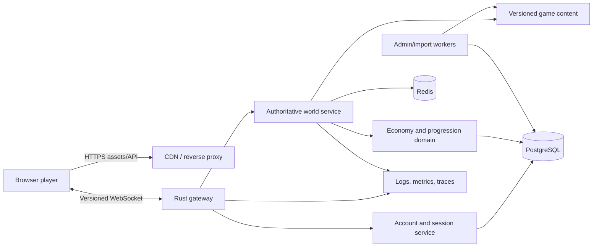
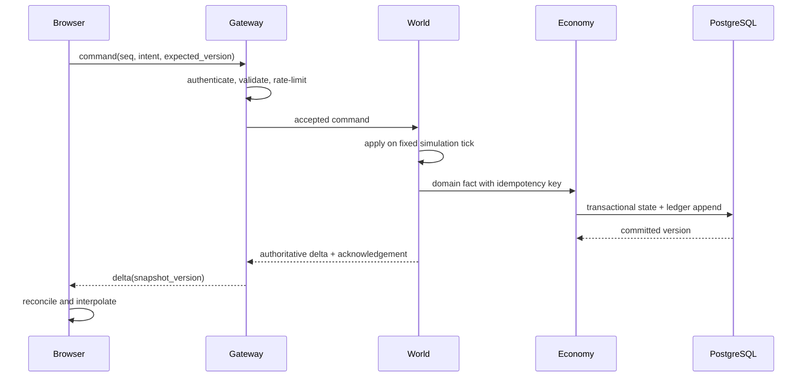

# Software Architecture

## Goals

- Reproduce the observable game experience on desktop and mobile browsers.
- Make cheating materially harder through server authority and transactional economy rules.
- Preserve all legally approved original assets, animation data, localization, audio, maps, and content records with verifiable provenance.
- Support incremental migration through playable end-to-end slices.
- Run the complete development environment with Docker.

## Quality Targets

| Area | Initial target |
| --- | --- |
| Client rendering | 60 FPS desktop, 30+ FPS supported mobile at p95 scene load |
| Simulation | 10 fixed ticks/second for active zones; event-driven while inactive |
| Input acknowledgement | p95 below 150 ms in the primary deployment region |
| Snapshot delivery | 5-10 updates/second, delta encoded |
| Availability | 99.9% after production readiness |
| Durability | No acknowledged economy transaction lost |
| Recovery | RPO <= 5 minutes, RTO <= 30 minutes |

## System Context

## Runtime Containers

### Web client

- TypeScript, PixiJS, and a lightweight component framework for non-world UI.
- PixiJS renders maps, actors, effects, and animation through WebGL/WebGPU where available.
- A client state buffer interpolates confirmed snapshots and predicts presentation-only movement.
- IndexedDB caches versioned content and assets; it is never authoritative.
- The client sends commands such as `equip_item`, `start_hunt`, or `upgrade_building`.

### Gateway

- Terminates authenticated WebSocket sessions and ordinary HTTP APIs.
- Validates protocol versions, message shape, sequence numbers, and rate limits.
- Routes commands to the owning world/session process.
- Applies backpressure and disconnect policy without containing game rules.

### Authoritative world service

- Owns zone state, fixed-step simulation, entity lifecycle, AI, combat, cooldowns, and server time.
- Uses deterministic integer/fixed-point math for game-relevant calculations.
- Produces state deltas for interested clients and domain events for durable changes.
- Degrades inactive villages to scheduled/event-driven simulation instead of continuous ticks.
- Uses the tiered authority boundary in ADR 0009: ordinary client-predicted farm
  simulation is asynchronously audited, while protected economy and ownership
  changes remain synchronously server-authoritative.

### Economy and progression domain

- Owns inventory, wallet, crafting, drops, quests, achievements, purchases, and rewards.
- Performs durable mutations in PostgreSQL transactions with idempotency keys.
- Accepts facts from the authoritative simulation, never client-computed rewards.

### Content pipeline

- Imports extracted source records into a canonical, versioned content model.
- Validates references, ranges, localization keys, animation clips, and asset checksums.
- Publishes immutable content releases. Active sessions pin a compatible release.
- Stores stable gameplay objects in normalized PostgreSQL tables; source JSON is
  an import artifact, not a production runtime fallback.
- Future admin tooling edits draft releases and promotes them atomically after
  validation and audit, never mutating an active release in place.

## Domain Boundaries

| Domain | Owns | Must not own |
| --- | --- | --- |
| Identity | account, auth provider links, sessions, bans | inventory or combat |
| World | entities, spatial state, AI, combat clock | durable wallet mutations |
| Economy | wallet, inventory, crafting, reward ledger | rendering or network sessions |
| Progression | hunter growth, quests, buildings, unlocks | authentication |
| Social | guild, membership, mail, rankings | combat truth |
| Content | immutable game definitions and localization | player state |
| Operations | imports, moderation, feature flags, release controls | direct unlogged state edits |

Begin as a modular monolith with explicit Rust crates/modules and one deployable server. Split services only after measured scaling or ownership pressure. Boundaries are still enforced in code and database access.

## Command And State Flow

## Data Architecture

PostgreSQL is the system of record. Core tables use UUID/ULID identifiers externally, monotonic versions for optimistic concurrency, UTC timestamps, and append-only ledgers for valuable mutations. Inventory and wallet writes are transactional. JSONB is limited to versioned extension data, world/workflow checkpoints, and compatibility snapshots; stable ownership is modeled relationally. Migration `0034_player_inventory_authority` separates stacked Hunter products from individually owned gear instances, while the legacy Hunter ownership JSONB remains only as a bounded migration fallback.

Redis may hold session presence, rate-limit buckets, distributed leases, matchmaking queues, pub/sub notifications, and disposable projections. Redis loss must not lose authoritative player value.

Every durable command carries an idempotency key. Database migrations are forward-only, reviewed, reversible by compensating migration, and exercised against production-like data volumes.

Gameplay content follows ADR 0010. PostgreSQL owns versioned object definitions
and relationships; Rust owns formulas, RNG, validation and state machines.
Server startup loads the pinned active catalogs and fails closed if required
rows are missing or incomplete.

## Network Protocol

- HTTPS for bootstrap, authentication, content manifests, health, and administrative APIs.
- Binary WebSocket messages for commands, acknowledgements, snapshots, and deltas.
- A single schema definition generates Rust and TypeScript types.
- Every envelope contains protocol version, session ID, sequence, correlation ID, message type, and payload.
- The server supports an explicit compatibility window; unsupported clients receive a machine-readable upgrade response.
- Never serialize internal database records directly onto the wire.

## Simulation Model

- Active zones execute a fixed 100 ms step by default.
- Town and ordinary hunting regions are one authoritative world instance.
  `Village` and `Field` are navigation/camera focus states, not separate
  authority boundaries: building, economy and service commands and clocks must
  remain available in both through the shared-world guard. Exact-town-only
  focus transitions remain explicit commands.
- Every new building or economy command requires regression coverage from both
  shared-world focus states so a legacy Village-only gate cannot silently
  reappear.
- Rendering remains independent at the browser refresh rate.
- Spatial interest management limits snapshots to relevant entities.
- AI uses bounded work budgets and deterministic scheduling.
- RNG uses server-owned streams scoped by encounter/domain; seeds are not disclosed before outcomes finalize.
- Offline progress is calculated from persisted timestamps and event rules, with server-defined caps.

### Original-flow application boundary

The rebuild remains a modular monolith. `OriginalFlowSession` is the application
facade for one leased player world: it owns orchestration, deterministic tick
ordering, durable before/after comparison, and operation draining. Feature rules
must not be added directly to its command router.

- `command_dispatch` maps generated protocol commands to application handlers;
  it does not own domain state or persistence.
- `economy` owns building, crafting, service, shop, and enhancement use cases.
- `hunter_actions` owns Hunter commands and authoritative trade settlement.
- `hunter_trade_workflow` is the state-machine boundary for beginning, restoring,
  resuming, and releasing durable Hunter trade tasks.
- `building_domain` and `hunter_domain` contain reusable domain policies and
  snapshot mapping for their bounded contexts.
- `projection` and `world_projection_support` form the anti-corruption layer
  from internal world state to protocol snapshots and evidence-aware
  presentation data.

New workflows should use a typed state machine or policy object when they span
multiple ticks or reconnects. Persisted strings remain compatibility fields at
the serialization boundary; transition decisions must be centralized rather
than duplicated across command, restore, and tick paths.

## Deployment Topology

Docker Compose is the local contract: client, server, PostgreSQL, Redis, migrations, and observability dependencies start reproducibly. Production images are multi-stage, non-root, pinned by digest, health-checked, and expose separate readiness and liveness endpoints.

Static assets are content-addressed and served through a CDN. Server processes are stateless except for explicitly leased active world ownership. Graceful shutdown stops admission, drains sessions, persists checkpoints, and releases leases.

## Failure Handling

- Database unavailable: reject value-changing commands; do not acknowledge speculative success.
- Redis unavailable: degrade presence/cache features; reconstruct from PostgreSQL where safe.
- Client disconnect: retain session briefly, then checkpoint and transition to offline simulation.
- Duplicate command: return the recorded idempotent result.
- Bad content release: halt promotion and roll clients back to the previous immutable manifest.
- Overloaded zone: reduce snapshot frequency and cosmetic work before affecting authoritative ticks.

## Evolution Rules

An ADR is required for changes to authority, transport, persistence technology, deployment boundaries, deterministic math, or compatibility policy. Performance claims require profiles or load tests. Service extraction requires a documented scaling bottleneck and ownership plan.

Internal source boundaries and the current decomposition roadmap are tracked in
`docs/architecture/source-boundary-audit.md`. `pnpm architecture:validate` is
the architecture fitness function for dependency direction and hotspot-size
ratchets.
